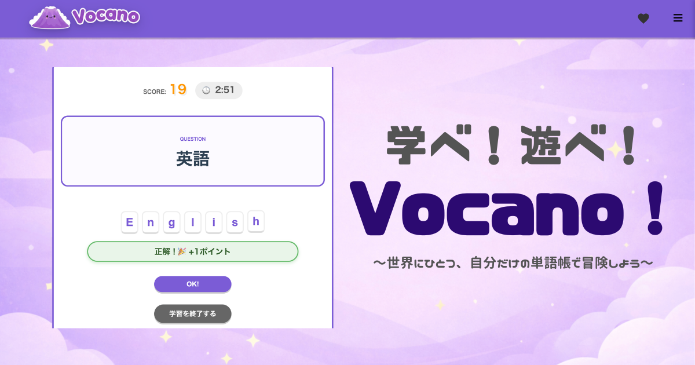

# 『Vocano!』

# 目次
- [サービス概要](#サービス概要)
- [サービスURL](#サービスURL)
- [サービス開発の背景](#サービス開発の背景)
- [対象ユーザーと利用イメージ](#対象ユーザーと利用イメージ)
- [差別化ポイント](#差別化ポイント)
- [機能紹介](#機能紹介)
  - [新規登録 / ログイン](#新規登録ログイン)
  - [キットを作る](#キットを作る)
  - [ゲームを開く](#ゲームを開く)
  - [ゲームに参加する](#ゲームに参加する)
  - [自習モード](#自習モード)
  - [コミュニティ](#コミュニティ)
  - [学習記録の確認](#学習記録の確認)
- [実装予定機能](#実装予定機能)
- [技術構成について](#技術構成について)
  - [使用技術](#使用技術)
  - [ER図](#ER図)
  - [画面遷移図](#画面遷移図)

# サービス概要

〜世界にひとつ、自分だけの単語帳で冒険しよう〜

『Vocano!』は、自分だけの単語帳を作り、スペルを学習することができるゲームです。
作った単語帳は、自習やマルチプレイモードに活用することができます。
授業の最初や、「あと10分余っちゃったどうしよう…」という時でも、単語帳さえ作っておけばいつでもゲームを始められます。

# サービスURL

https://vocano-spelling-game-ver2.onrender.com

# サービス開発の背景

教員時代、英語嫌いな生徒が多かったため、授業に集中してくれず、どうすれば引き込めるか悩んでいました。
試しに授業の最初に単語の4択問題のゲームを取り入れたところ、今まで授業に向き合えなかった生徒も楽しそうに参加してくれるようになり、単語テストが0点だった生徒が簡単な単語を書けるようになりました。
しかし、選択問題ではスペルの定着が難しく、かといってスペルを書く勉強法は生徒の集中力が続かないという状況でした。

そこで、授業の最初5分で生徒を引き込み、スペルをしっかり学習できるアプリがあれば、同じように困っている先生の助けになると思い、このサービスを作りたいと思いました。

生徒がゲームを楽しめる理由として、私は以下の点に注目しました。

- 即時のフィードバックがある
- 達成感と成長を実感できる
- 自分で内容を選べる
- 他者と競争ができる
- 視覚的にわかりやすい

これらを詰め込んだアプリが『Vocano!』となっています。

# 対象ユーザーと利用イメージ

## メインユーザー: 中学校・高校の英語教員

### 対象
- 中学校、高校の先生
- 授業の雰囲気作りに悩んでいる先生
- 授業の工夫をしたいけれど、忙しくて考えたり実践する時間がない先生

### サービスを使ってほしい理由

1. **授業の雰囲気を一気に盛り上げたい**
  - 授業の最初5分で生徒を楽しく引き込み、その後の授業の流れを作る
  - クラス全体を巻き込むゲーム感覚で、授業への集中力を高める

2. **授業中の柔軟な対応に使いたい**
  - 授業中に時間が余った時の選択肢として
  - 予定していた内容が早く終わった時の調整に

3. **授業準備の負担を軽減したい**
  - 忙しい中でも、オリジナル問題を簡単に作成できる
  - 毎回の授業準備の時間を少しでも減らしたい

## サブユーザー: 単語を学習している生徒

### 対象
- 英語が苦手な生徒
- 授業に集中できない生徒
- 単語学習に苦手意識がある生徒

### このサービスを使ってほしい理由

1. **英語を楽しいと感じてほしい**
  - 英語が嫌いな生徒でも、授業の最初5分は楽しんで英語に向き合える
  - ゲーム感覚で、単語学習のハードルを下げる

2. **小さな成功体験を積んでほしい**
  - ポイントを競い合うことで、達成感を味わえる
  - ランキング表示で、自分の成長を実感できる
  - 学習記録で自分の頑張りを確認できる

3. **スペルをしっかり学習してほしい**
  - 選択問題ではなく、スペルを入力することで定着を促す
  - 簡単な単語から始めて、徐々に難しい単語に挑戦できる

## サービスの利用イメージ
### 先生側
カードを作成してゲームをセットしておくだけで、生徒の学びになり、授業の雰囲気を作ることができます。

### 生徒側
ゲームに参加するだけで、単語のスペルを楽しんで学ぶことができ、「単語の勉強ができた」「問題が解けた」という達成感と成長を実感できます。
また、自分で問題を作ったり、コミュニティにある他の人が作った単語帳を使って自習をすることもできます。

# 差別化ポイント

本サービスは、既存の英単語学習ツールの良い点を活かしつつ、学習効果とゲーム性のバランスを最適化した英単語学習アプリです。

## 1. Quizletとの差別化

### Quizletの特徴
- フラッシュカード、スペルテスト、選択ゲームなど多様な学習モードを提供
- 世界中で広く使われている無料オンライン学習ツール

### 本サービスの差別化ポイント
**即座のフィードバック × 適度なゲーミフィケーション**

Quizletのスペルテストは提出後にしか正誤がわからないため、学習のテンポが悪く、間違いに気づくのが遅れてしまいます。また、パズルピース獲得型のゲームモードは、ゲーム性が強すぎて「学習よりもゲームクリア」が目的になってしまう課題があります。

本サービスでは、以下の2点で差別化します:
- **リアルタイムフィードバック**: スペル入力と同時に正誤判定を行い、学習のテンポとモチベーションを維持
- **学習中心のゲーミフィケーション**: ポイント制とランキング機能により、学習そのものが報酬となる設計

## 2. Gimkitとの差別化

### Gimkitの特徴
- クイズ正解で仮想通貨を獲得し、アップグレードを購入できるゲーム性の高い学習プラットフォーム
- 教師向けに詳細な学習レポート機能を提供
- 無料プランでは機能や人数に制限があり、本格利用には月額$14.99が必要

### 本サービスの差別化ポイント
**スペル定着 × 完全無料**

Gimkitは4択クイズ形式のため、単語の意味理解には効果的ですが、実際にスペルを書く力は身につきません。また、教育機関での本格利用には有料プランが必須です。

本サービスでは、以下の2点で差別化します:
- **スペル入力による実践的学習**: 選択式ではなくタイピング入力により、実際に使える英単語力を養成
- **完全無料での提供**: Gimkitのポイント制やゲーム性の良さを取り入れつつ、個人学習者が無料で利用可能

# 機能紹介

## 新規登録/ログイン

https://github.com/user-attachments/assets/46c849a7-f577-4cd4-b17e-1d44c30bdbe5

『ニックネーム』『メールアドレス』『パスワード』『パスワード確認』を入力して新規登録を行います。新規登録後は自動的にログイン処理が行われるようになっており、そのまますぐにサービスを利用することができます。
また、Googleアカウントを用いてGoogleログインを行うことも可能です。

## キットを作る

https://github.com/user-attachments/assets/3f528cf9-adca-4484-b260-384d77e97aa6

『キット名』『英単語』『日本語』『タグ』を入力してゲームキットを作成することができます。『公開設定』では、ゲームキットの公開・非公開を選択することができます。公開の場合はコミュニティで他の人も使うことができます。

## ゲームを開く

https://github.com/user-attachments/assets/77a56d43-176a-4f9f-88af-5e9f3c4133c8

ゲームキットを選択し、制限時間を入力します。参加者が揃ったらゲームを開始できます。

## ゲームに参加する

https://github.com/user-attachments/assets/ab996897-1912-42a7-8835-69ba92804ed6

ホストの画面に表示してあるゲームコードとニックネームを入力し、ゲーム開始まで待機します。
ゲームが始まったら、問題の英単語を入力してエンターキーを押します。
正解すると+1ポイント、不正解だと-1ポイントとなり、最終的にランキング形式で結果発表があります。

## 自習モード

https://github.com/user-attachments/assets/116d7747-4519-4ed8-ba92-bece20732464

自習したいゲームキットを選択し、制限時間を入力します。『自習をスタート！』を押すとすぐにゲームが始まります。制限時間後には最終的な獲得スコアを確認することができます。

## コミュニティ

https://github.com/user-attachments/assets/183853b9-6a8f-42fc-abc8-cbe34f30e06b

他の人が作った公開ゲームキットを見ることができたり、気に入ったゲームキットはお気に入り登録や、自分のゲームキットにコピーすることができます。

## 学習記録の確認

https://github.com/user-attachments/assets/2c87ee18-4204-444d-a5ea-aca79834b017

『累計学習時間』『累計学習ポイント』を確認することができます。カレンダーでは、学習した日を確認することができ、視覚的に学習日数を把握することができます。

# 実装予定機能

## CSVインポート機能
ゲームキット作成時の入力負担を減らすため、CSV形式でのインポートに対応予定です。デジタル教科書などのデータをコピペするだけで問題を作れるようになります。

## 苦手単語帳の自動生成
間違えた問題を記録・集計し、苦手な単語だけをまとめた単語帳を自動で作成します。繰り返し学習しやすい仕組みを目指しています。

## 不正解問題の再入力機能
現在は不正解時に正解を表示するだけですが、正しいスペルを自分で入力してから次に進む仕組みにすることで、見るだけで終わらない学習を目指します。

# 技術構成について

## バックエンド
- Ruby 3.1.4 / Ruby on Rails 7.1.x
- PostgreSQL 15.x
- Redis 7.2
- ActionCable（WebSocketによるリアルタイム同期）

## フロントエンド
- HTML / SCSS / JavaScript
- Hotwire（Turbo + Stimulus）

## 主要Gem
- `sorcery` 0.16.3 − ユーザー認証
- `turbo-rails` 2.0.x − Turbo
- `stimulus-rails` 1.3.x − Stimulus
- `redis` 5.3.0 − ActionCableバックエンド

## インフラ
- 開発環境: Docker Compose
- 本番環境: Render

## 画面遷移図

Figmaリンク: https://www.figma.com/design/SwN1tGqSU9vSm4KwPUoKie/Vocano--%E7%94%BB%E9%9D%A2%E9%81%B7%E7%A7%BB%E5%9B%B3?node-id=0-1&t=mtIKnYG5juTqK7Kr-1

## ER図

